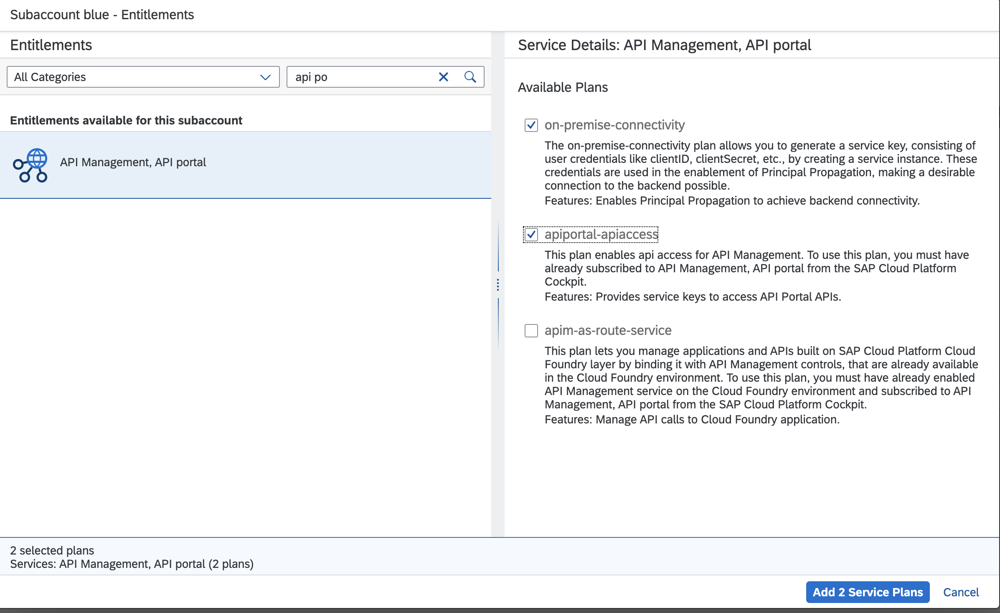
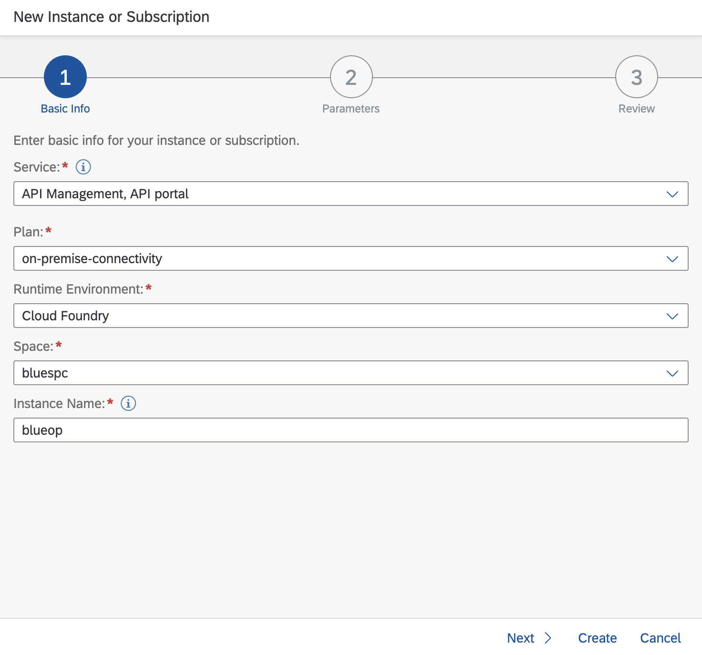
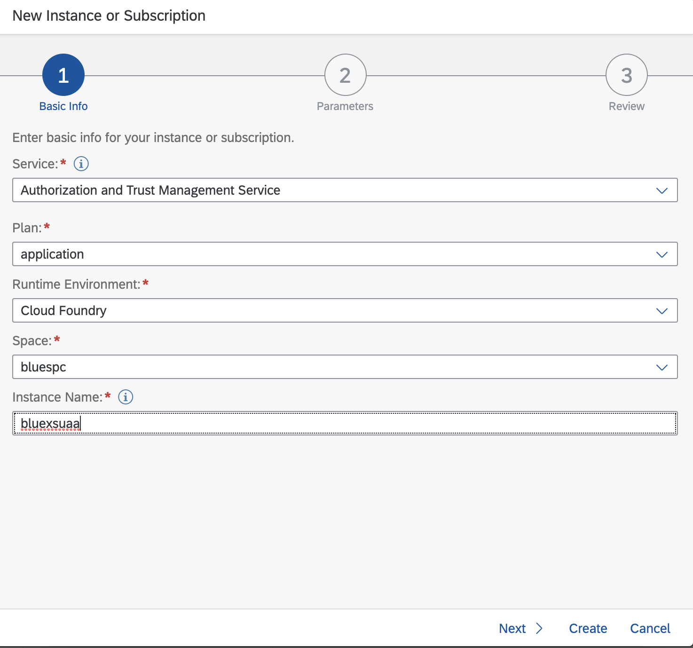
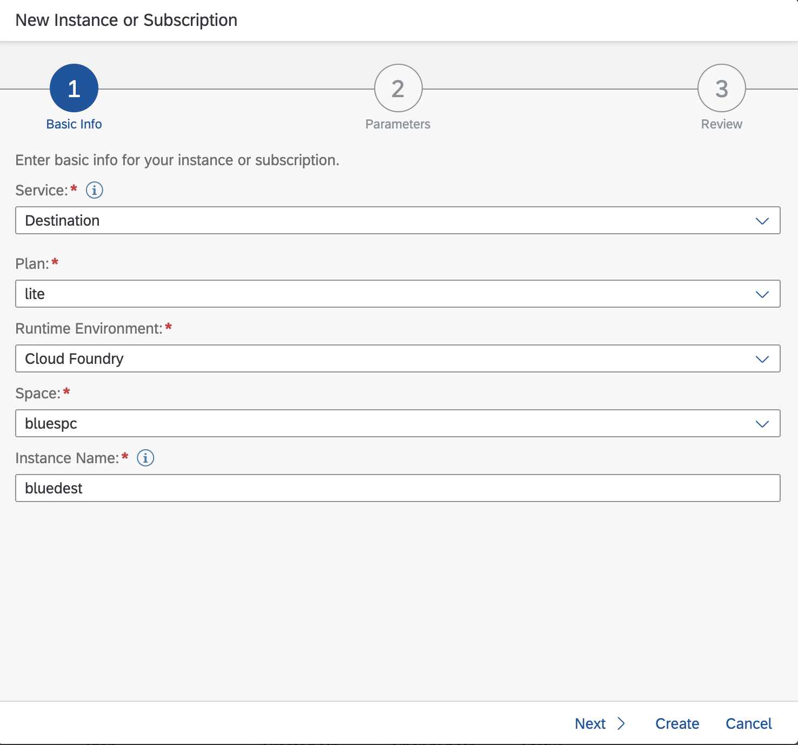
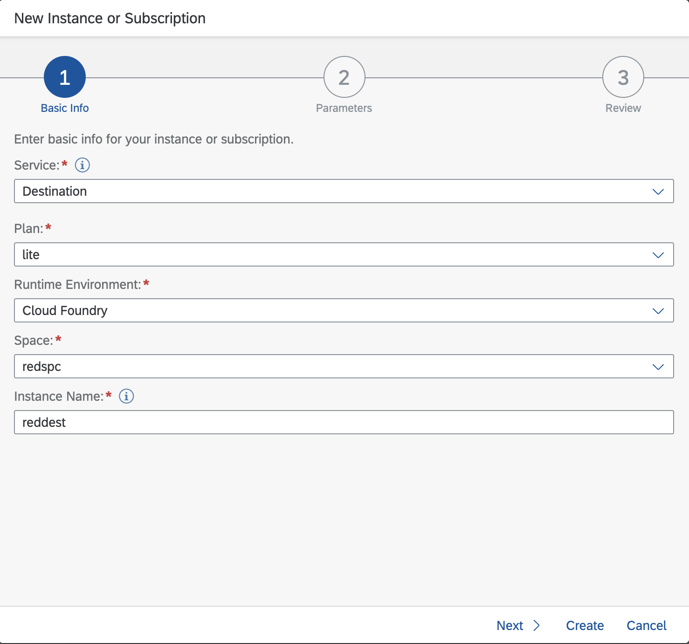

<p align="center">
  <h1 align="center">Principal Propagation with SAP API Management</h1>
  <p align="center">
    This documentation depicts the use cases and step by step configuration for Principal Propagation on SAP API Management on Cloud Foundry . 
    <br />
  </p>
</p>

<!-- TABLE OF CONTENTS -->
<details open="open">
  <summary>Table of Contents</summary>
  <ol>
    <li>
      <a href="#about">About</a>
    </li>
    <li>
      <a href="#Prerequisites">Prerequisites</a>
    </li>
    <li>
      <a href="#getting-started">Setup & Configuration</a>
      <ul>
        <li><a href="#Prerequisites">Own CF Subaccount</a></li>
        <li><a href="#installation">CF-CF Subaccount</a></li>
        <li><a href="#installation">Subaccount on NEO</a></li>
        <li><a href="#installation">External Accounts: Azure Active Directory</a></li>
      </ul>
    </li>
     <li>
      <a href="#consumption">Consumption</a>
        <ul>
        <li><a href="#installation">Postman Collection</a></li>
        <li><a href="#prerequisites">CF Apps</a></li>
        <li><a href="#installation">UI5 Application</a></li>
      </ul>
    </li>
  </ol>
</details>


<!-- ABOUT -->
## About

* [Overview of Principal Propagation ](https://help.sap.com/viewer/cca91383641e40ffbe03bdc78f00f681/Cloud/en-US/e2cbb48def4342048362039cc157b12e.html)
* This documentation depicts the step-by-step configurations required to setup Principal Propagation for the following scenarios within the Cloud Foundry capability SAP API Management under the SAP Integration Suite in SAP BTP Platform.
* The Configurations of the Cloud Connector and the backend systems are left out of scope.
* The Configurations of SAP API Management applies to Prod,Canary,Trial landscape,this document only depicts the Trial setups. The configurations remain which same for other landscapes. 


<!-- GETTING STARTED -->
## Prerequisites

1. [Activate your Trial Account](https://developers.sap.com/tutorials/hcp-create-trial-account.html)
2. Create Two sub-accounts within the Trial Global account </br>
  a. Sub-account name: **red** , Sub-domain name : red , Region of choice </br>
  </br>
  b. Sub-account name: **blue** , Sub-domain name : blue, Region of choice </br>
  </br>

3. In sub-account:**blue** enable the Integration Suite and add SAP API Management cabaility by [Setup Integration Suite Trial](https://developers.sap.com/tutorials/cp-starter-isuite-onboard-subscribe.html)
4. Enable Cloud Foundry in both sub-accounts </br>
5. In sub-account:**blue** </br>
  a. Click on Entitlements-> Configure Entitlements -> Add Service Plans-> API Management, API Portal , enable and save </br> **on-premise connectivity** </br> **apiportal-apiaccess** </br></br>
    </br>
  b. Enable </br> Service Instances: **API Management , API Portal** </br> Plan: **on-premise-connectivity** </br> Instance Name: **blueop** </br></br>
    </br>
  c. Enable </br> Service Instances: **Authorization and Trust Management Service** </br> Plan: **application** </br> Instance Name: **bluexsuaa** </br></br>
    </br>
  d. Enable </br> Service Instances: **Destination** </br> Plan: **lite** </br> Instance Name: **bluedest** </br></br>
    </br>
  e. Create Service Keys for **blueop** , **bluexsuaa** , **bluedest** respectively </br>
  
6. In sub-account:**red** </br>
  a. Enable </br> Service Instances: **Authorization and Trust Management Service** </br> Plan: **application** </br> Instance Name: **redxsuaa** </br></br>
    </br>
  b. Enable </br> Service Instances: **Destination** </br> Plan: **lite** </br> Instance Name: **reddest** </br></br>
    </br>
  e. Create Service Keys for **redxsuaa** , **reddest** respectively </br>
  
7. Clone the repo
   ```sh
   git clone https://github.com/SAP/apibusinesshub-api-recipes.git
   ```

<!-- CONTRIBUTING -->
## Setup and Configuration

### Own CF sub-account

In this case , **the User token generation and the SAP API Management service is hosted within the same sub-account**. The below picture depicts the landscape. </br>
    </br>
    Flow Summary:
    
    1. The User Logs in using the XSUAA service instance. A token is generated in exchange of username and password . This token contains the User Principle. 
    2. The Client requests the API Proxy endpoint and passes the token as part of the header request
    3. API Proxy verifies if the token is valid and requests Destination Service to exchange the token
    4. The token is passed to the Cloud Connector which queries the backend to present the response
    
### Steps to enable the Flow
#### Generate and Upload Destination
#### Configure API Proxy

## CF-CF subaccount 
In this case , **the User token generation and the SAP API Management service is hosted in different sub-account**. The below picture depicts the landscape. </br>
    </br>
    Flow Summary:
    
    1. The User Logs in using the XSUAA service instance from origin sub-account. A token is generated in exchange of username and password . This token contains the User Principle. 
    2. The Client requests the API Proxy endpoint(hosted on target sub-account) and passes the token as part of the header request
    3. API Proxy verifies if the token is valid and requests Destination Service(on the origin account) to exchange the token
    4. The token is passed to the Cloud Connector which queries the backend to present the response

### Steps to enable the Flow
#### Establish Trust between sub-accounts
#### Generate and Upload Destination
#### Configure API Proxy

Contributions are what make the open source community such an amazing place to be learn, inspire, and create. Any contributions you make are **greatly appreciated**.

1. Fork the Project
2. Create your Feature Branch (`git checkout -b feature/AmazingFeature`)
3. Commit your Changes (`git commit -m 'Add some AmazingFeature'`)
4. Push to the Branch (`git push origin feature/AmazingFeature`)
5. Open a Pull Request

