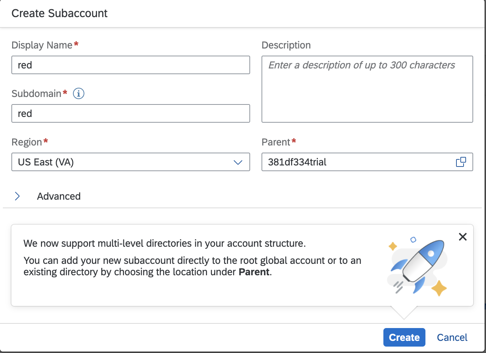
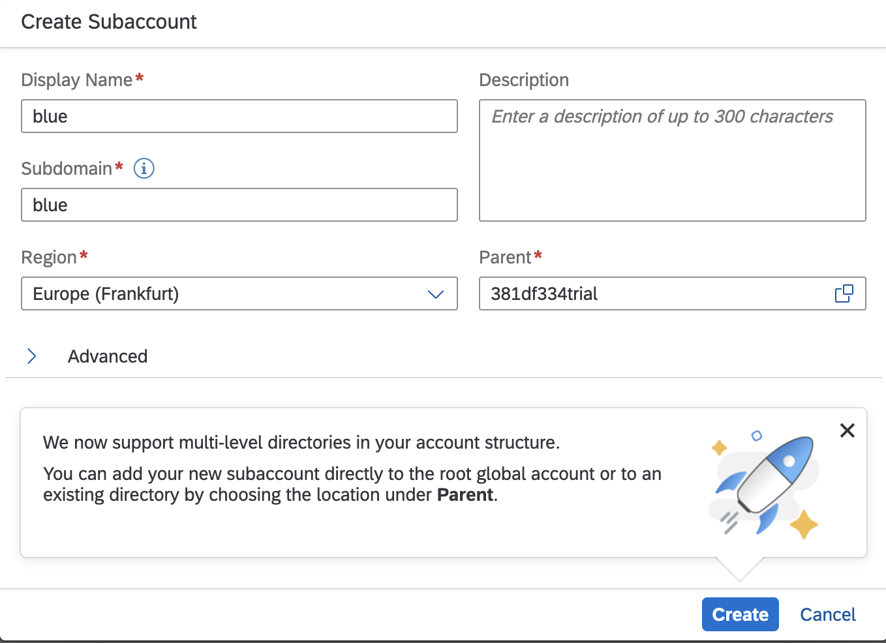
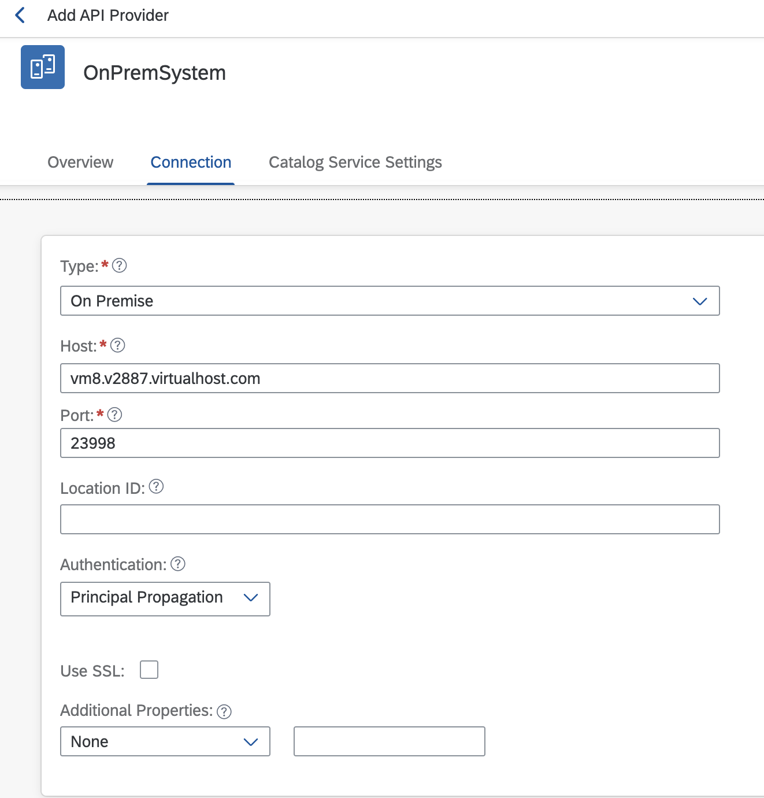
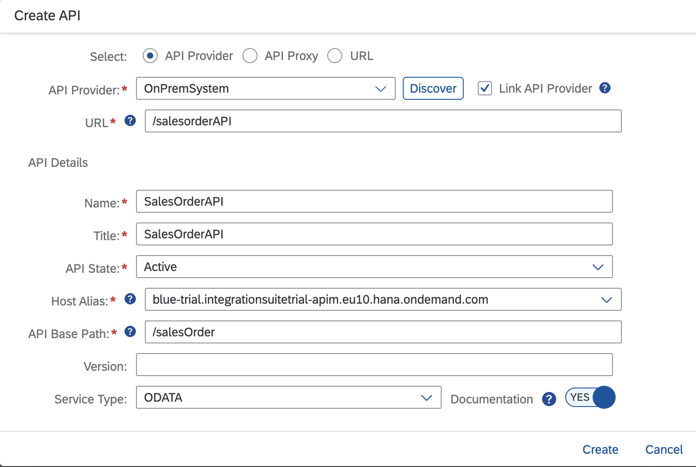

<p align="center">
  <h1 align="center">Principal Propagation with SAP API Management</h1>
  <p align="center">
    This documentation depicts the step by step configuration for Principal Propagation on SAP API Management on Cloud Foundry . 
    <br />
  </p>
</p>

<!-- TABLE OF CONTENTS -->
<details open="open">
  <summary>Table of Contents</summary>
  <ol>
    <li>
      <a href="#about">About</a>
    </li>
    <li>
      <a href="#prerequisites">Prerequisites</a>
       <ul>
        <li><a href="#activate-trial">Activate Trial</a></li>
        <li><a href="#create-subaccounts">Create subaccounts</a></li>
        <li><a href="#enable-cloud-foundry">Enable Cloud Foundry</a></li>
        <li><a href="#configure-subaccount-target">Configure subaccount:target</a>
       <ul>
        <li><a href="#configure-entitlements">Configure Entitlements</a></li>
        <li><a href="#service-instance-destination">Service Instance for Destination</a></li>
        <li><a href="#service-instance-xsuaa">Service Instance for XSUAA</a></li>
        <li><a href="#service-instance-opproxy">Service Instance for On-premise-connectivity</a></li>
      </ul>
         </li>
        <li><a href="#configure-subaccount-origin">Configure subaccount:origin</a>
          <ul>
        <li><a href="#service-instance-destination">Service Instance for Destination</a></li>
        <li><a href="#service-instance-xsuaa">Service Instance for XSUAA</a></li>
      </ul>
         </li>
        <li><a href="#clone-repository">Clone Repository</a></li>
      </ul>
    </li>
    <li>
      <a href="#prepare">Prepare</a>
       <ul>
        <li><a href="#create-api-provider">Create API Provider</a></li>
        <li><a href="#create-api-proxy">Create API Proxy</a></li>
        <li><a href="#import-policy-template">Import Policy Template</a></li>
        <li><a href="#apply-policy-template-to-api-proxy">Apply Policy Template to API Proxy</a></li>
      </ul>
    </li>
    <li>
      <a href="#setup-and-configuration">Setup and Configuration</a>
      <ul>
        <li><a href="#user-token-generation-and-sap-apim-is-hosted-on-the-same-cf-subaccount">User Token Generation and SAP APIM is hosted on the same CF subaccount</a>
        <ul>
        <li><a href="#generate-and-upload-destination">Generate and Upload Destination</a></li>
        <li><a href="#configure-api-proxy">Configure API Proxy</a></li>
        <li><a href="#configure-policy">Configure Policy</a></li>
        <li><a href="#consume">Consume </a></li>
      </ul>
        </li>
        <li><a href="#user-token-generation-and-sap-apim-is-hosted-on-the-different-cf-subaccount">User Token Generation and SAP APIM is hosted on the different CF subaccount</a>
         <ul>
         <li><a href="#establish-trust-between-sub-accounts">Establish Trust Between sub-accounts</a></li>
        <li><a href="#generate-and-upload-destination">Generate and Upload Destination</a></li>
        <li><a href="#configure-api-proxy">Configure API Proxy</a></li>
        <li><a href="#consume">Consume</a></li>
      </ul>
        </li>
        <li><a href="#neo-cf-subaccount">User Token generation on NEO, APIM hosted on CF</a></li>
        <li><a href="#azure-active-directory">User Token generation on Azure Active Directory</a></li>
        <li><a href="#azure-active-directory">User Token generation on SAP IAS</a></li>
      </ul>
    </li>
     <li>
      <a href="#consumption">Consumption</a>
        <ul>
        <li><a href="#cf-apps">CF Apps</a></li>
        <li><a href="#ui5-application">UI5 Application</a></li>
      </ul>
    </li>
  </ol>
</details>


<!-- ABOUT -->
## About

* [Overview of Principal Propagation ](https://help.sap.com/viewer/cca91383641e40ffbe03bdc78f00f681/Cloud/en-US/e2cbb48def4342048362039cc157b12e.html)
* This documentation depicts the step-by-step configurations required to setup Principal Propagation forncenarios within the Cloud Foundry capability SAP API Management under the SAP Integration Suite in SAP BTP Platform.
* A single API Proxy shall be configured to provide for Principal Propagation from the same and different sub-accounts within CF runtime of SAP APIM
* The Configurations of the Cloud Connector and the backend systems are left out of scope.
* The Configurations of SAP API Management applies to Prod,Canary,Trial landscape,this document only depicts the Trial setups. The configurations remain same for other landscapes.


<!-- Prerequisites -->
## Prerequisites
### Activate Trial 
 [Activate your Trial Account](https://developers.sap.com/tutorials/hcp-create-trial-account.html)
### Create Subaccounts
Create Two sub-accounts within the Trial Global account </br>
  a. Sub-account name: **red** , Sub-domain name : red , Region of choice </br> This will be the **origin** subaccount as token generation happens here </br></br> 
  </br>
  b. Sub-account name: **blue** , Sub-domain name : blue, Region of choice </br> This is the **target** subaccount as APIM is hosted here </br></br>
  </br>
  
### Enable Integration Suite
In sub-account:**blue** enable the Integration Suite and add SAP API Management cabaility by [Setup Integration Suite Trial](https://developers.sap.com/tutorials/cp-starter-isuite-onboard-subscribe.html)
### Enable Cloud Foundry 
Enable Cloud Foundry in both sub-accounts </br>

### Configure subaccount target
In sub-account:**blue** </br>

#### Configure Entitlements
Click on *Entitlements-> Configure Entitlements -> Add Service Plans-> API Management, API Portal , enable and save* </br> **on-premise connectivity** </br> **apiportal-apiaccess** </br></br>
    </br>
    
#### Service Instance OPProxy
Enable </br> Service Instances: **API Management , API Portal** </br> Plan: **on-premise-connectivity** </br> Instance Name: **blueop** </br></br>
    </br>
    
#### Service Instance XSUAA
Enable </br> Service Instances: **Authorization and Trust Management Service** </br> Plan: **application** </br> Instance Name: **bluexsuaa** </br></br>
    </br>
    
#### Service Instance Destination
Enable </br> Service Instances: **Destination** </br> Plan: **lite** </br> Instance Name: **bluedest** </br></br>
    </br>
    
#### Generate Service keys
Create Service Keys for **blueop** , **bluexsuaa** , **bluedest** respectively </br>

### Configure subaccount origin
In sub-account:**red** </br>
  a. Enable </br> Service Instances: **Authorization and Trust Management Service** </br> Plan: **application** </br> Instance Name: **redxsuaa** </br></br>
    </br>
  b. Enable </br> Service Instances: **Destination** </br> Plan: **lite** </br> Instance Name: **reddest** </br></br>
    </br>
  e. Create Service Keys for **redxsuaa** , **reddest** respectively </br>
### Clone Repository
Clone the repo
   ```sh
   git clone https://github.com/SAP/apibusinesshub-api-recipes.git
   ```


## Prepare
Within the API Portal Application do the following
### Create API Provider
Navigate to *Configure -> API Providers -> Create*  </br>
**Host** : Virtual Host of the backend system configured within Cloud Connector </br>
**Port** : Port of the Virtual Host configured within Cloud Connector
</br>

### Create API Proxy
Navigate to *Develop -> APIs-> Create*
</br>


### Import Policy Template
Navigate to *Develop -> Policy Templates -> Import -> Browse* </br>
Import the Policy Template avialble within the [cloned repository](#clone-repository) path: </br> 
*/apibusinesshub-api-recipes/principalPropagation/PrincipalPropagationOnCF*

### Apply Policy Template to API Proxy
*Develop->APIs ->Click on the SalesOrder API created above and follow<br>
Policy ->Edit ->Policy Template ->Apply ->Check PrincipalPropagationOnCF ->Apply ->Update ->Save ->Deploy </br>*
The below policies should be applied </br></br>


<!-- Setup and Configuration -->
## Setup and Configuration

### User Token Generation and SAP APIM is hosted on the same CF subaccount

In this case , **the User token generation and the SAP API Management service is hosted within the same sub-account**. The below picture depicts the landscape. </br>
    </br>
    Flow Summary:
    
    1. The User Logs in using the XSUAA service instance. A token is generated in exchange of username and password . This token contains the User Principle. 
    2. The Client requests the API Proxy endpoint and passes the token as part of the header request
    3. API Proxy verifies if the token is valid and requests Destination Service to exchange the token
    4. The token is passed to the Cloud Connector which queries the backend to present the response
    
### Steps to enable the Flow
#### Generate and Upload Destination
Target subaccount : **blue** </br>
Perform the steps mentioned [here](utility/readme.md#generate-destination-for-oauth2usertokenexchange) to generate and upload the Destination

#### Configure API Proxy

Perform the steps mentioned in the [Configure Policy](#configure-policy) . The XSUAA and the Destination Service keys are taken from the target sub-account , in this case subaccount: **blue** </br>


#### Configure Policy  

Naigate to the *API Proxy -> Policy Editor -> Scripts -> setConfig.js* . The configObj contains the below configurations . The parameters of the configObj needs to be filled for the flow
```
var configObj = {
  "enableDebug": false,
  "invalidateCache": false,
  "accounts": {
    "dummyname": {
      "issuer": "<sample>",
      "publicKey": "<sample>",
      "destinationName": "<sample>",
      "destinationUri": "<sample>",
      "destinationAuthEndpoint": "<sample>",
      "destinationClientId": "<sample>",
      "destinationClientSecret": "<sample>"
    }
  }
}
```
An **account** in the **configObj.accounts** above is a subaccount where token generation happens. In case the API Proxy expects token from multiple subaccounts within CF, each of these subaccounts need to be added within configObj.accounts. By this mechanism the single API Proxy supports principal propagation of users from  multiple CF subaccounts as well as itself.


**issuer** <br>
The issuer of the Token . Can be found by decrpyting the generated token and taking the value of **iss** key,also
```
Within Service Key of XSUAA -> take the 'url' parameter and add /oauth/token . Below is the format required
https://<subdomain>.authentication.<host>.com/oauth/token
```
**publicKey**
```
Within Service Key of XSUAA -> take the 'verificationkey' parameter.Below is the format required
-----BEGIN PUBLIC KEY-----****-----END PUBLIC KEY-----
```
**destinationName**
```
The Name of the Destination uploaded in the previous step
```
**destinationUri**
```
Within the Service Key of Destination -> take the 'uri' parameter without the 'https://'. Below is the format required
destination-configuration.cfapps.<data_center>.<host>.com
```
**destinationAuthEndpoint**
```
Within the Service Key of Destination -> take the  'url' parameter without the 'https://'. Below is the format required
<subdomain>.authentication.<host>.com
```
**destinationClientId**
```
Within the Service Key of Destination -> take the 'clientid' parameter
```

**destinationClientSecret**
```
Within the Service Key of Destination -> take the 'clientsecret' parameter
```

### Consume

Request the XSUAA for the token inexchange of the userid and userpassword. In this case subdomain is : **blue**
```
curl --location --request POST 'https://<subdomainName>.authentication.<host>.com/oauth/token?grant_type=password'
--header 'Authorization: Basic <base64Encoded of (xsuaaClientId:xsuaaClientSecret)>’
--header 'Content-Type: application/x-www-form-urlencoded'
--data-urlencode 'username=<user id>’
--data-urlencode 'password=<user password>’
```
Request the API Proxy endpoint

```
curl --location --request GET 'https://<API_PROXY endpoint>'
--header 'Authorization:<access_token from above request>'
```


## User Token Generation and SAP APIM is hosted on the different CF subaccount

In this case , **the User token generation and the SAP API Management service is hosted in different sub-account**. The below picture depicts the landscape. </br>
    </br>
    Flow Summary:
    
    1. The User Logs in using the XSUAA service instance from origin sub-account. A token is generated in exchange of username and password . This token contains the User Principle. 
    2. The Client requests the API Proxy endpoint(hosted on target sub-account) and passes the token as part of the header request
    3. API Proxy verifies if the token is valid and requests Destination Service(on the origin account) to exchange the token
    4. The token is passed to the Cloud Connector which queries the backend to present the response

### Steps to enable the Flow
#### Establish Trust between sub-accounts
Target subaccount : **blue** </br>
Origin subaccount : **red** </br>
Perform the steps mentioned [here](utility/readme.md#generate-trustxml) to generate the Trust XML
#### Generate and Upload Destination
Target subaccount : **blue** </br>
Origin subaccount : **red** </br>
Perform the steps mentioned [here](utility/readme.md#generate-destination-for-oauth2samlbearerassertion) to generate and upload the Destination
#### Configure API Proxy
Perform the steps mentioned in the [Configure Policy](#configure-policy) . The XSUAA and the Destination Service keys are taken from the origin sub-account , in this case subaccount: **red**

### Consume

Request the XSUAA for the token inexchange of the userid and userpassword. In this case subdomain is : **red**
Refer [here](#consume)


# External Links
[Api-management-mini-security-series](https://blogs.sap.com/2020/06/28/sap-cloud-platform-api-management-mini-security-series/)


# Contributions
Contributions are what make the open source community such an amazing place to be learn, inspire, and create. Any contributions you make are **greatly appreciated**.

1. Fork the Project
2. Create your Feature Branch (`git checkout -b feature/AmazingFeature`)
3. Commit your Changes (`git commit -m 'Add some AmazingFeature'`)
4. Push to the Branch (`git push origin feature/AmazingFeature`)
5. Open a Pull Request